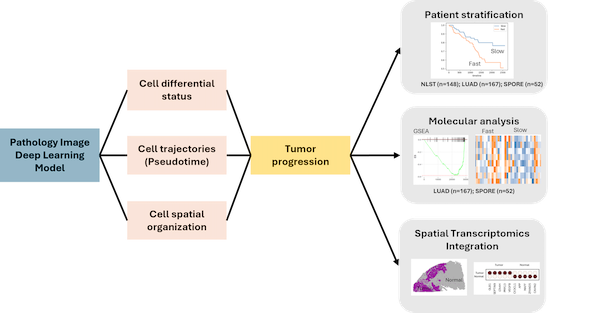
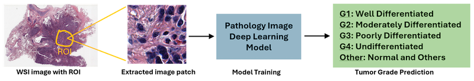
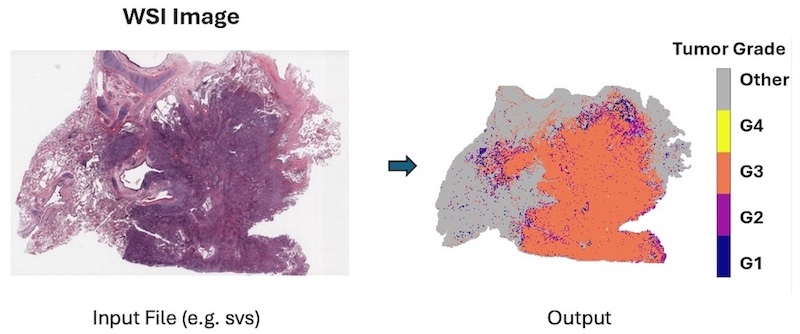
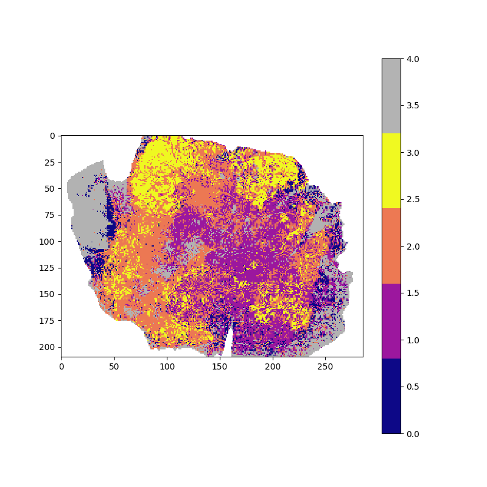

# ImagePseudo: Image-based inference of tumor cell trajectories enables large-scale cancer progression analysis

Author: Yang Liu (Yang.Liu2@utsouthwestern.edu)

## Introduction

An AI-powered approach transforms routine pathology slides into dynamic maps of tumor evolution, enabling large-scale analysis of cancer progression without the need for costly single-cell sequencing.

## Citation
 Liu Y, Cai L, Rong R, Wang S, Jia L, Quan P, Zhou Q, Xiao G, Xie Y. Image-based inference of tumor cell trajectories enables large-scale cancer progression analysis. **Sci Adv.** 2025 Jul 18;11(29):eadv9466. doi: 10.1126/sciadv.adv9466. Epub 2025 Jul 18. PMID: 40680117; PMCID: PMC12273761. [Pubmed](https://pubmed.ncbi.nlm.nih.gov/40680117/)

## Overview of ImagePseudo

### ImagePseudo Inference

### From Input to Output

## This repository includes
* Feature extraction from pretained model and tumor grade prediction
* Estimating pseudotime from extracted features
* Inference tumor growth speed, diversity and tumor progression fitness

## Dependencies

* Python >= 3.9 (Here we use Python 3.9 for conda environment)

* numpy==1.26.4
* pandas==2.2.1
* torch
* torchvision
* transformers==4.38.2
* scanpy==1.9.8
* opencv-python==4.9.0.80
* lifelines==0.28.0
* scikit-learn==1.4.1
* scikit-image==0.22.0
* scipy==1.12.0
* matplotlib==3.8.3
* seaborn==0.13.2
* anndata==0.10.6
* numexpr==2.9.0

You can install them to your conda environment by
<pre>
pip install requirement.txt
</pre>

* openslide
* igraph
* leidenalg

Your can install them into your conda environment by
<pre>
conda install -c conda-forge openslide
conda install -c conda-forge python-igraph
conda install -c conda-forge leidenalg
</pre>

## Build up conda environment

* Install Conda [https://docs.conda.io/projects/conda/en/latest/user-guide/install/index.html](https://docs.conda.io/projects/conda/en/latest/user-guide/install/index.html)

You can skip the installation of conda if already installed

* Create conda environment 'imagepseudo' using requirement.txt
<pre>
conda create --name imagepseudo python=3.9
conda activate imagepseudo
pip install -r requirement.txt
conda install -c conda-forge openslide
conda install -c conda-forge python-igraph
conda install -c conda-forge leidenalg
</pre>

## Download pretrained model and example pathology images in svs format

* Example data and pretrained model are available at Zenode: [https://zenodo.org/records/16376974](https://zenodo.org/records/16376974)
* [option] Choose Version v2 on right-side link if v1 is chosen
* Download "example.svs" and "model.tar.gz" to this project directory
* Unzip "model.tar.gz" under this project directory, and move to the subfolder "model" (create this folder if not exists)
<pre>
tar -xvf model.tar.gz
mkdir model
mv model.pt model/
</pre>
 
## User Guideline

### Step 1: Extracting features for tumor grading prediction from WSIs

**Input**

Input a folder containing all SVS files to proceed.

<pre>
mkdir input_folder  # create a folder
mv example.svs input_folder/   # move svs file under it. Can be many
python GradePrediction.py --data_path ./input_folder --model model/model.pt --output_path feature/
</pre>

Input Parameters:

| Parameter | Description | Default Value |
| --------- | ----------- | ------------ |
| data_path | the folder containg the SVS files | |
| model | the path of mdoel file 'model.pt' | |
| pixel_step | pixel step for patch extraction | 400 |
| output_path | the relative path to output the feature | |

**Output files**

- [example.svs_286cols_210rows.csv](./example_result/example.svs_286cols_210rows.csv)

- example.svs_286cols_210rows.png

### Step 2: Exstimate pseudotime from extracted features
<pre>
python Pseudotime.py --feature_path feature/ --output_path pseudotime/
</pre>

**Input Foler (the folder 'feature' from step 1)**

The code will scan the folder 'feature' to deal with all CSV files

- E.g. [example.svs_286cols_210rows.csv](./example_result/example.svs_286cols_210rows.csv)

**Output file**

- [example.svs_286cols_210rows.csv.h5ad](./example_result/example.svs_286cols_210rows.csv.h5ad)

### Step 3: Inference tumor growth speed, diversity and tumor progression fitness
<pre>
python Fitness.py --input_path pseudotime/ --output_file results.csv
</pre>

**Input Foler (the folder 'pseudotime' from step 2)**

The code will scan the folder 'pseudotime' to deal with all h5ad files

- E.g. [example.svs_286cols_210rows.csv.h5ad](./example_result/example.svs_286cols_210rows.csv)

**Output File**

- [results.csv](./example_result/results.csv)

### License
Following UT Southwestern Office for Technology Development, the project is using the license from The University of Texas Southwestern Medical Center.
