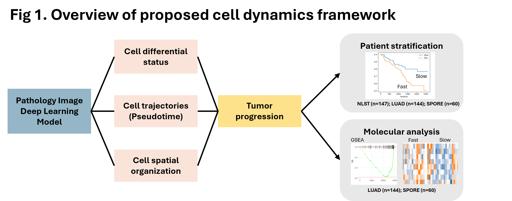
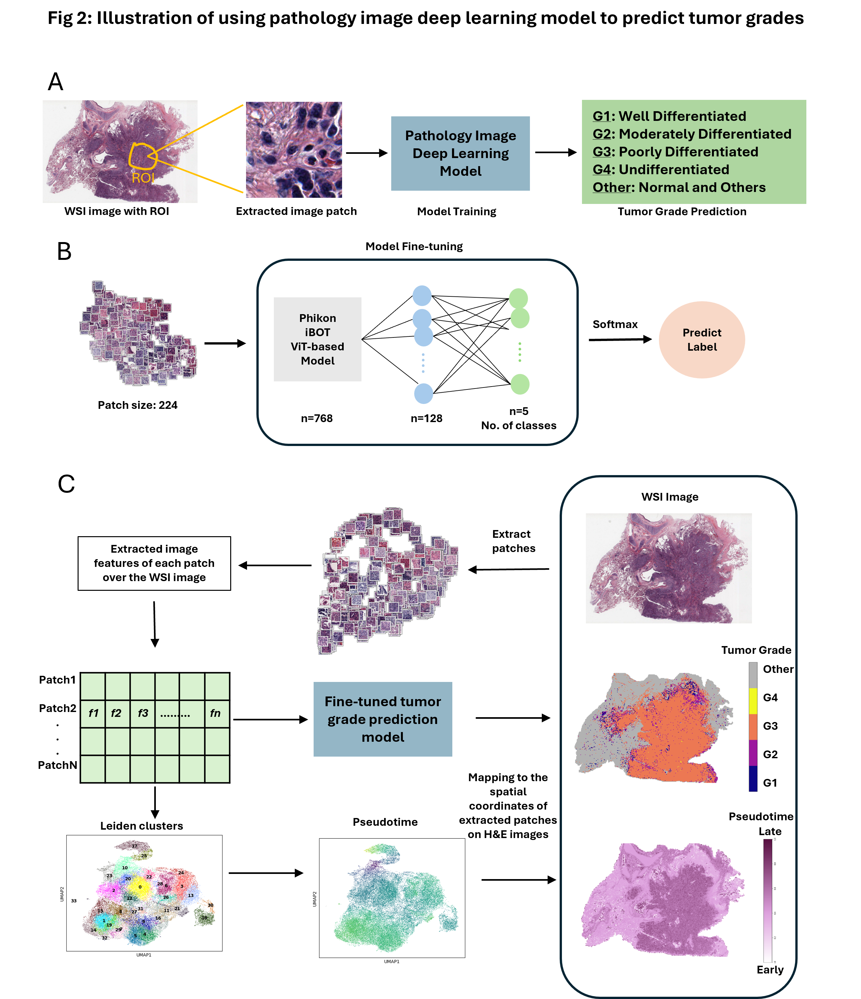

# Image-based inference of tumor cell trajectories enables large-scale cancer progression analysis
An AI-powered approach transforms routine pathology slides into dynamic maps of tumor evolution, enabling large-scale analysis of cancer progression without the need for costly single-cell sequencing.

## This repository includes
* [Model training and testing](./scripts/phikon_model-weighted_224.ipynb)
* [How to extract image patch features across the whole slide pathology images for the prediction of tumor grades](./scripts/Feature_Extraction.ipynb)
* [How to calculate pseudotime, quantify tumor progression and downstream analysis of association with patient survivals](./scripts/Pseudotime_Fitness_Survival-nlst-224.ipynb)

## Requirements
* python 3
* pandas==2.2.1
* torch==2.2.1+cu118
* torchvision==0.17.1+cu118
* transformers==4.38.2
* opencv-python==4.9.0.80
* openslide-python==1.3.1
* lifelines==0.28.0
* scikit-learn==1.4.1.post1
* scipy==1.12.0
* scanpy==1.9.8
* matplotlib==3.8.3
* seaborn==0.13.2
* anndata==0.10.6
